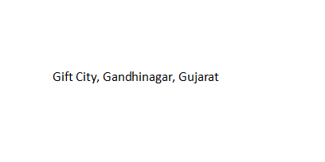
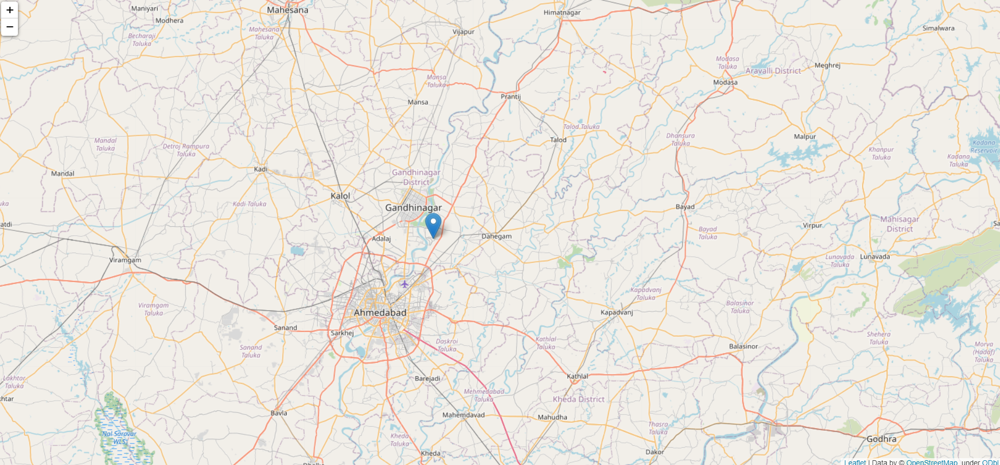
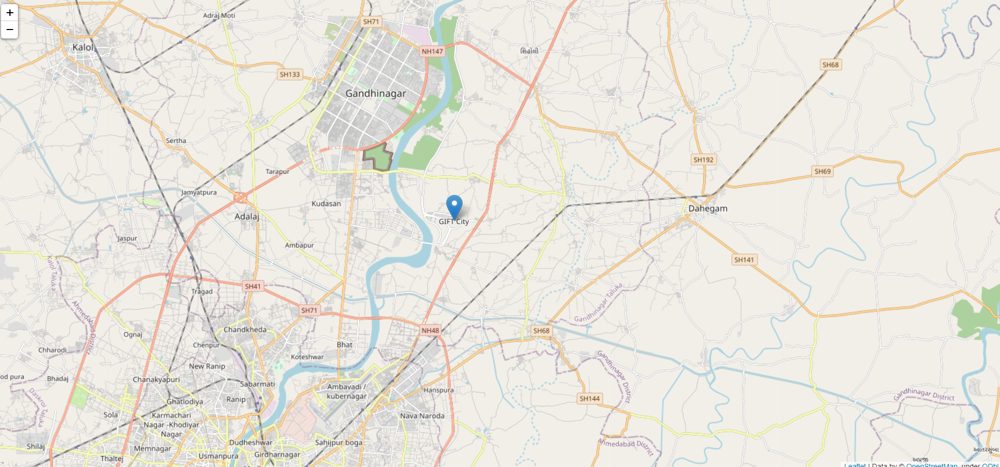
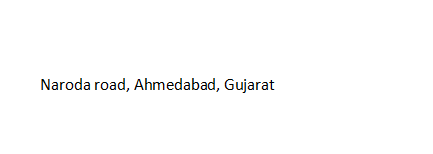
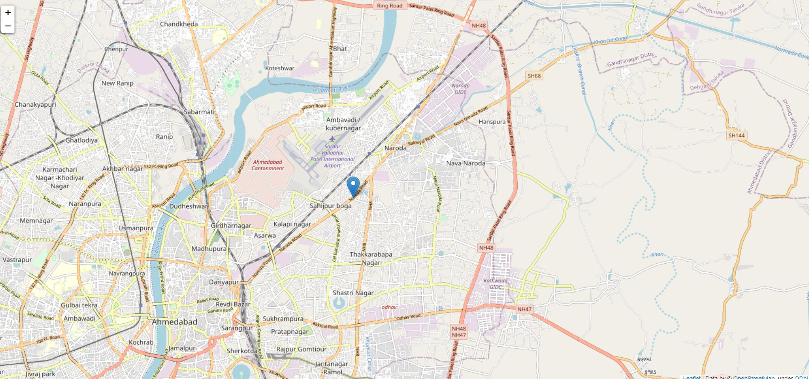

# Finding Address on Google Map

I used the opencv to detect the text from the image. Then using `Google Map API` to find the address on `Google Map`

## Example 1:
#### First take the image which has text "Gift City, Gandhinagar, Gujarat"

#### We detect the text using tesseract library after that we give the text to the google api to find the address on map. 
#### Output:

## Example 2:
#### Here we take the image which has text "Naroda road, Ahmedabad, Gujarat"

#### Output:

